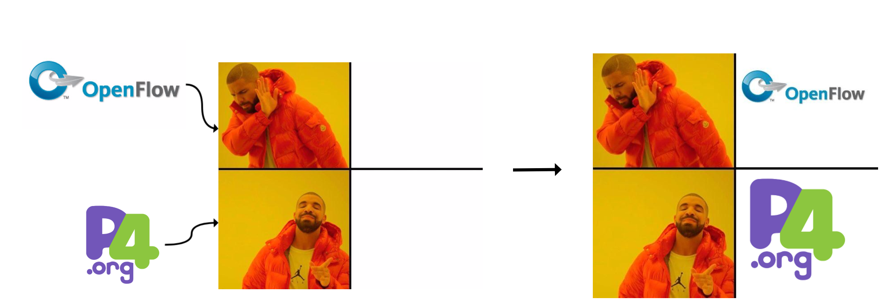

# MemeGen

[](https://badge.fury.io/js/memegen)
[](https://img.shields.io/npm/dm/memegen.svg)

A meme generator.



# How to use

## Install 

* Install globally

```bash 
# switch to root
$ sudo su
# and then install with option "--unsafe-perm"
$ npm install memegen --unsafe-perm --verbose memegen -g
# use 
$ memegen --help
```

* Or use it locally

```bash
# install 
$ npm install memegen --save
# use (under same directory you use install command)
$ node node_modules/memegen/main.js --help
```

* 

---

## Usage

### Static Template (For Drake meme)
* Example:

```bash
memegen -1 upper.png -2 lower.png -o output_dir -f output_filename -t png
```

* See some example!
    * Bang!
    

---

### Dynamic Configuration
* [Config file format](https://github.com/toolbuddy/memegen/wiki/Configuration)

* Example:

```bash
memegen -c <config>.json -f <output_file_name> -t png -o <output_dir>
```

* See some example, which generate from specific configuration file!
    * Cereal guy meme
        * [configure file](config_cereal.json)
        * `memegen -c config_cereal.json -f use_config_cereal -t png -o output`
        
    * Peter parker meme
        * [configure file](config.json)
        * `memegen -c config.json -f use_config -t png -o output`
        

* or just using `--help`:

```bash
memegen --help
```